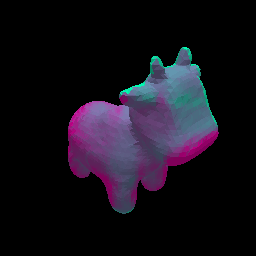

# MeshSDF

This is a PyTorch implementation of the NeurIPS'20 SpotLight paper "MeshSDF: Differentiable Iso-Surface Extraction". You can find the paper [here](https://arxiv.org/abs/2006.03997).



## Installation

To get started, simply clone the repo and run the setup bash script, which will take care of installing all packages and dependencies.

```
git clone https://github.com/cvlab-epfl/MeshSDF.git
cd MeshSDF
./setup.sh
```

## Data

In our project, we store data according to the following structure:
```
data/
  <dataset_name>/
      samples/
          <instance_name>.npz
      meshes/
          <instance_name>.obj
      renders/
          <instance_name>/
              00.png
              ...
              rendering_metadata.txt

```

We provide pre-processed and subsampled ShapeNet data for [cars](https://drive.google.com/file/d/1KCnZjWUuQQSGjc2C_Z0_j4IFBYmZ8GvG/view?usp=sharing) and [chairs](https://drive.google.com/file/d/1I05H7X8__jKak8OdwXPu7cD7BOF8mfa8/view?usp=sharing) to get you started.
Simply download it and unzip it in the `data/` folder to get going.

In case you are interested in using different data, below we detail how to obtain and pre-process the ShapeNet data we used in our project.
Do not forget to cite the authors of the respective papers if you find this data useful for your research.

### Mesh data

We use data from [ShapeNetCore.v1](https://www.shapenet.org). Specifically, we use cleaned surface meshes from [here](https://github.com/laughtervv/DISN). Please refer to their repo to download ShapeNetCore.v1 clean models.

### SDF data

Once you have downloaded cleaned ShapeNetCore.v1 models, we generate SDF training data using the pre-processing script from [DeepSDF](https://openaccess.thecvf.com/content_CVPR_2019/html/Park_DeepSDF_Learning_Continuous_Signed_Distance_Functions_for_Shape_Representation_CVPR_2019_paper.html). Please refer to their repo for more info on how to generate SDF samples.

### Image data

We use rendered ShapeNetCore.v1 models from [DISN](https://github.com/laughtervv/DISN). Please refer to their repo for more info on how to generate synthetic renders.


## Differentiable iso-surface extraction

We show how to backpropagate gradient information from mesh
vertices to latent vector while modifying surface mesh topology through a simple toy-experiment.

As an example of a loss function defined on an explicit surface mesh, we consider silhouette
distance, obtained through [differentiable rasterization](https://hiroharu-kato.com/publication/neural_renderer/).
For this experiment, we consider a dataset consisting of two shapes, bob, a genus-1 rubber duck, and spot, a genus-0 cow.

To get started, first learn a [deep signed distance function](https://openaccess.thecvf.com/content_CVPR_2019/html/Park_DeepSDF_Learning_Continuous_Signed_Distance_Functions_for_Shape_Representation_CVPR_2019_paper.html) representation for this dataset by running

```
python train_deep_sdf.py -e experiments/bob_and_spot
```

You can then exploit our differentiability result to minimize silhouette distance between spot and bob

```
python demo_optimizer.py -e experiments/bob_and_spot/
```

In our paper, we also propose an heuristic to accelerate iso-surface extraction when performing optimization in an iterative fashion, which results in a noticeable speed-up. You can use our heuristic by running

```
python demo_optimizer.py -e experiments/bob_and_spot/ --fast
```

## Single-view reconstruction

You can train a SVR model for cars by running

```
python train_svr.py -e experiments/cars_svr
```

Once the model is trained, you can run silhouette based refinement, as presented in our work, by running

```
python reconstruct_svr.py -e experiments/cars_svr/
```

Finally, to gather results and compute metrics, run

```
python metrics_svr.py -e experiments/cars_svr/
```


## Cite us

If you find MeshSDF useful for your research, please cite our
[paper](https://arxiv.org/abs/2006.03997):
```
@inproceedings{remelli2020meshsdf,
 author = {Remelli, Edoardo and Lukoianov, Artem and Richter, Stephan and Guillard, Benoit and Bagautdinov, Timur and Baque, Pierre and Fua, Pascal},
 booktitle = {Advances in Neural Information Processing Systems},
 editor = {H. Larochelle and M. Ranzato and R. Hadsell and M. F. Balcan and H. Lin},
 pages = {22468--22478},
 publisher = {Curran Associates, Inc.},
 title = {MeshSDF: Differentiable Iso-Surface Extraction},
 url = {https://proceedings.neurips.cc/paper/2020/file/fe40fb944ee700392ed51bfe84dd4e3d-Paper.pdf},
 volume = {33},
 year = {2020}
}
```
